<div align="center">

# Sublyzer Snapshot

**Turn any codebase into a live Sublyzer dashboard in 30 seconds.**

Scan routes, dependencies, and vulnerabilities locally — get a health score — push everything to [Sublyzer](https://sublyzer.com). No SDK required for your first check.

<br />

[](https://www.npmjs.com/package/sublyzer-snapshot)
[](LICENSE)
[](https://nodejs.org)
[](https://www.typescriptlang.org)
[](https://sublyzer.com)

<br />

[`Quick Start`](#-quick-start) · [`How It Works`](#-how-it-works) · [`Commands`](#-commands) · [`CI/CD`](#-cicd) · [`Docs`](#-environment-variables) · [Sublyzer Dashboard](https://sublyzer.com/dashboard)

<br />

```
  $ npx sublyzer-snapshot init && npx sublyzer-snapshot run

  Project:         my-saas-app
  Stack:           Next.js (high)
  Health:          [████████░░] 82/100  grade B
  Routes:          14
  Vulnerabilities: 2 (critical 0, high 1)
  ✓ Sent 6 events → dashboard updated
```

</div>

---

## ✨ Introduction

**Sublyzer Snapshot** is an open-source CLI that answers one question every developer asks:

> *"How healthy is my project right now?"*

Instead of wiring up three separate tools (dependency scanner, route inventory, monitoring dashboard), you run **one command**. Snapshot scans your repo locally, computes a **health score (0–100)**, and pushes structured events to your **Sublyzer** integration — where you (or an AI agent like Hermes) can read them back.

Built for **indie hackers**, **startup teams**, and **agencies** who want instant project visibility without a week of DevOps setup.

---

## 🎯 What is it for?

| Use case | What you get |
|----------|--------------|
| **First-time project check** | Stack detection, route map, CVE summary in ~30s |
| **Pre-deploy sanity check** | Health score + vulnerability gate before shipping |
| **CI/CD pipeline** | `--fail-on high` blocks merges with critical CVEs |
| **Client / team reports** | `report --out HEALTH.md` — shareable Markdown |
| **Trend tracking** | `compare` shows what changed since last scan |
| **Sublyzer onboarding** | Data in your dashboard before installing the browser SDK |

### Before vs After

| Before | After (Sublyzer Snapshot) |
|--------|---------------------------|
| Sentry + Dependabot + manual spreadsheet | One CLI, one dashboard |
| 45+ min setup | ~30 seconds |
| No unified health score | 0–100 score with grade A–F |
| Hard to show clients "project status" | Export `report.md` in one command |

---

## ⚙️ How it works

```mermaid
flowchart LR
  A[Your repo] --> B[sublyzer-snapshot run]
  B --> C[Local scan]
  C --> D[Routes · deps · audit · git]
  D --> E[Health score 0-100]
  E --> F[Sublyzer API]
  F --> G[Dashboard]
  G --> H[Hermes / agents / team]

  style A fill:#1e293b,stroke:#475569,color:#f8fafc
  style G fill:#2563eb,stroke:#1d4ed8,color:#fff
  style E fill:#22c55e,stroke:#16a34a,color:#fff
```



1. **`init`** — Links your project folder to a Sublyzer integration (24-char code).
2. **`run`** — Scans locally: framework, routes, `npm audit`, outdated packages, git metadata.
3. **Score** — Computes health grade from vulnerabilities, routes, env hygiene, and more.
4. **Push** — Sends events to `POST /data-collection/collect-batch` on Sublyzer.
5. **Dashboard** — Data appears under your integration; optional SDK for live telemetry later.

Scan history is stored in `.sublyzer/` (gitignored automatically) so `compare` can show diffs over time.

---

## 🚀 Quick start

### Prerequisites

- **Node.js 18+**
- **npm** (for audit/outdated; optional with `--skip-audit`)
- A [Sublyzer](https://sublyzer.com) account + **integration code** (24 chars, from Dashboard → Integrations)

### Install & run

```bash
# 1. Link your project
npx sublyzer-snapshot init

# 2. Scan and push
npx sublyzer-snapshot run

# 3. Open dashboard
npx sublyzer-snapshot open
```

Non-interactive (CI / scripts):

```bash
export SUBLYZER_INTEGRATION_CODE="YOUR_24_CHAR_CODE"
npx sublyzer-snapshot init -y
npx sublyzer-snapshot run --fail-on high
```

### Development (this monorepo)

```bash
cd projects/sublyzer-snapshot
npm install && npm run build
node dist/cli.js init --code YOUR_CODE -y
node dist/cli.js run --dry-run
```

---

## 🧰 Commands

| Command | Description |
|---------|-------------|
| `init` | Detect stack, validate code, write `.sublyzer/snapshot.json` |
| `run` | Full scan + push to Sublyzer |
| `report` | Generate Markdown health report (`--out report.md`) |
| `compare` | Diff routes, vulns, and score vs previous scan |
| `ci` | Print or write GitHub Actions workflow |
| `status` | Show linked integration + last scan |
| `doctor` | Verify config, API, integration code, read key |
| `pull` | Fetch data back via public read API (needs `apiReadKey`) |
| `open` | Open integration in browser |

### Common flags

```bash
sublyzer-snapshot run --dry-run          # Local preview, no push
sublyzer-snapshot run --skip-audit       # Faster scan
sublyzer-snapshot run --fail-on high     # Exit 1 on high/critical CVEs
sublyzer-snapshot run --json             # CI-friendly JSON output

sublyzer-snapshot report --out HEALTH.md
sublyzer-snapshot compare --rescan
sublyzer-snapshot ci --out .github/workflows/sublyzer-snapshot.yml
```

---

## 📊 Health score

Every scan produces a **0–100 score** and letter grade (**A–F**):

| Factor | Impact |
|--------|--------|
| Critical CVEs | −25 each (max −50) |
| High CVEs | −10 each (max −30) |
| Moderate CVEs | −3 each |
| Web stack with 0 routes detected | −8 |
| Dirty git working tree | −3 |
| Missing `.env.example` | −2 |
| Major outdated packages | −3 each |

Example terminal output:

```
  Health:        [████████░░] 82/100  grade B
```

The score is also sent to Sublyzer as a `snapshot_health_score` performance metric.

---

## 🔍 What gets detected

| Stack | Signals |
|-------|---------|
| **Next.js** | `next` in package.json, `app/` & `pages/` routes |
| **NestJS** | `@nestjs/core`, decorator routes |
| **Express / Fastify** | Route patterns in source |
| **Remix / Nuxt / SvelteKit** | package.json dependencies |
| **React / Vue / Node** | Fallback detection |
| **Monorepos** | npm & pnpm workspaces |

Each `run` sends:

- `custom_event` → `project_snapshot` (stack, routes, git, audit summary)
- `vulnerability` → top npm audit findings
- `performance` → health score + route count

---

## 🔄 CI/CD

### Fail the build on vulnerabilities

```bash
sublyzer-snapshot run --fail-on high --json > snapshot-result.json
```

Levels: `critical` · `high` · `moderate` · `any`

### Generate GitHub Actions workflow

```bash
sublyzer-snapshot ci --out .github/workflows/sublyzer-snapshot.yml
```

Add repository secret: **`SUBLYZER_INTEGRATION_CODE`**

The generated workflow runs on push, PR, and weekly schedule — uploads JSON + Markdown report as artifacts.

---

## 🤖 Read data back (agents & API)

Push uses the **integration code**. To **read** snapshot data programmatically (e.g. Hermes):

```bash
# Get read key (authenticated)
curl "https://api.sublyzer.com/integrations/{id}/read-access" \
  -H "Authorization: Bearer YOUR_JWT"

# Or via CLI
sublyzer-snapshot pull --read-key YOUR_READ_KEY
```

Set `SUBLYZER_READ_KEY` in env or save during `init --read-key ...`.

---

## 🔐 Environment variables

| Variable | Required | Description |
|----------|----------|-------------|
| `SUBLYZER_INTEGRATION_CODE` | For `init` | 24-character integration code |
| `SUBLYZER_READ_KEY` | For `pull` | Public read API key |
| `SUBLYZER_API_URL` | No | Default: `https://api.sublyzer.com` |
| `SUBLYZER_DASHBOARD_URL` | No | Default: `https://sublyzer.com` |

> **Security:** `.sublyzer/snapshot.json` contains your integration code. It is auto-added to `.gitignore` on `init` — never commit it to public repos.

---

## 📁 Project structure (local)

```
your-project/
├── .sublyzer/
│   ├── snapshot.json       # Linked integration config
│   ├── last-snapshot.json  # Latest scan cache
│   └── history/            # Previous scans (for compare)
├── src/
└── package.json
```

---

## 🛣️ Roadmap

- [ ] npm publish (`npx sublyzer-snapshot`)
- [ ] `login` flow (no manual code paste)
- [ ] Bundle size analysis
- [ ] PR comment bot (GitHub App)

---

## 📄 License

MIT © [Sublyzer](https://sublyzer.com) — see [LICENSE](./LICENSE).

---

<div align="center">

**[Sublyzer](https://sublyzer.com)** · **[Documentation](https://sublyzer.com/docs)** · **[Dashboard](https://sublyzer.com/dashboard)**

<br />

If this saved you time, ⭐ star the repo — it helps other devs find it.

<br />

<sub>Built with TypeScript · Powered by <a href="https://sublyzer.com">Sublyzer</a> observability platform</sub>

</div>
