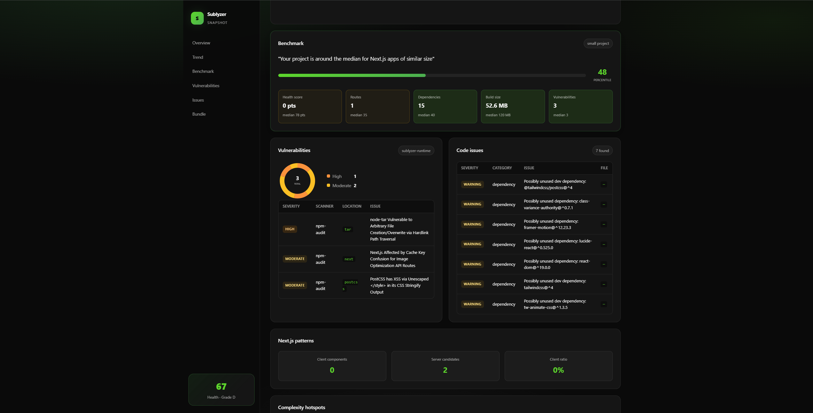

<div align="center">

# Sublyzer Snapshot


**Local project health scanner for any Node.js codebase.**

Works **standalone** — no account required. Optionally sync to [Sublyzer](https://sublyzer.com) cloud when you want a live dashboard.

<br />

[](https://www.npmjs.com/package/sublyzer-snapshot)
[](LICENSE)
[](https://nodejs.org)

<br />

[`Quick Start`](#-quick-start) · [`Standalone vs Cloud`](#-standalone-vs-cloud) · [`Monorepos`](#-monorepos) · [`Commands`](#-commands) · [`Roadmap`](#-roadmap)

<br />

```
  $ npx sublyzer-snapshot scan

  Scan root:     frontend (auto-selected)
  Stack:         Next.js (high)
  Health:        [████████░░] 84/100  grade B
  Routes:        42
  Build output:  12.4 MB (.next)
  ✓ Saved to .sublyzer/ (local)
```

<br />



**Dashboard report** — offline HTML with health score, trends, treemap, and issues. Run `npx sublyzer-snapshot dashboard` to generate and open it in your browser.

</div>

---

## ✨ Introduction

**Sublyzer Snapshot** is an open-source CLI that scans your repo and answers:

> *How healthy is this project right now?*

It runs **entirely on your machine**: stack detection, routes, dependency audit, outdated packages, build size, git metadata, and a **0–100 health score**.

**Sublyzer cloud is optional** — use it when you want events in a shared dashboard, agents (Hermes), or team visibility. Without cloud, you still get reports, history, CI gates, and compare diffs.

---

## 🔀 Standalone vs Cloud

| | **Standalone (default)** | **Cloud (optional)** |
|---|--------------------------|----------------------|
| Account | None | [Sublyzer](https://sublyzer.com) integration code |
| Command | `npx sublyzer-snapshot scan` | `init --code …` then `run --push` |
| Output | Terminal + `.sublyzer/` history | + Sublyzer dashboard |
| CI | `scan --fail-on high` | + optional push via secret |

```bash
# Standalone — zero setup
npx sublyzer-snapshot scan

# Optional cloud link
npx sublyzer-snapshot init --code YOUR_24_CHAR_CODE -y
npx sublyzer-snapshot run --push
```

---

## 🚀 Quick start

### Install (use npx — recommended)

```bash
npx sublyzer-snapshot@latest --version
```

Do **not** run `npm i sublyzer-snapshot` in random folders — use `npx` to avoid unrelated peer dependency conflicts.

### Scan any project

```bash
cd your-project
npx sublyzer-snapshot scan
npx sublyzer-snapshot report --html
npx sublyzer-snapshot report --badge
npx sublyzer-snapshot report --out HEALTH.md
```

### Save preferences (local)

```bash
npx sublyzer-snapshot init --local
npx sublyzer-snapshot run
```

### Optional cloud sync

```bash
npx sublyzer-snapshot init --code YOUR_24_CHAR_CODE -y
npx sublyzer-snapshot run --push
npx sublyzer-snapshot open
```

---

## 📦 Monorepos

Snapshot **auto-picks** the best package in monorepos (npm/pnpm workspaces, `frontend/`, `backend/`, etc.).

```bash
# From repo root — auto-selects e.g. frontend/
npx sublyzer-snapshot scan

# Force a subfolder
npx sublyzer-snapshot scan --path backend
npx sublyzer-snapshot init --local --path frontend
```

On `init`, other scannable packages in the repo are listed as hints.

---

## 🧰 Commands

| Command | Description |
|---------|-------------|
| **`scan`** | Local scan — **no init, no account** |
| `init` | Save config — `--local` or `--code` for cloud |
| `run` | Scan + history (pushes in cloud mode or with `--push`) |
| `report` | Markdown, **`--html`**, **`--badge`** |
| **`dashboard`** | Gera e abre HTML no browser |
| `compare` | Diff vs previous scan |
| `doctor` | Verify Node, scan target, optional cloud |
| `status` | Config + last scan |
| `ci` | GitHub Actions template |
| `pull` / `open` | Cloud only (read API / dashboard) |

### Flags

```bash
npx sublyzer-snapshot scan --path frontend
npx sublyzer-snapshot scan --fail-on high --json
npx sublyzer-snapshot scan --skip-deep          # fast scan, skip code analysis
npx sublyzer-snapshot report --html --out report.html
npx sublyzer-snapshot report --badge
npx sublyzer-snapshot run --local              # never push
npx sublyzer-snapshot run --push               # force cloud push
npx sublyzer-snapshot run --skip-audit         # faster
```

---

## 🧠 Deep analysis (v0.5)

Every scan includes (unless `--skip-deep`):

- **Intelligent health score** — CVEs, trends, code issues, Next.js patterns
- **Health trends** — history chart in HTML report
- **Code smells** — long files, deep nesting, `any`, empty catch, console.log
- **Cyclomatic complexity** — top hotspots
- **Duplicate blocks** — repeated code detection
- **Next.js anti-patterns** — client ratio, missing `use client`, fetch in client
- **Unused dependencies** — import scan
- **Bundle treemap** — breakdown of `.next/` / `dist/`
- **Benchmarks** — percentile vs similar apps (anonymous heuristics)
- **Multi-stack** — also detects Python (`pyproject.toml`) and Go (`go.mod`)

### Custom rules

Add `.sublyzer/rules.json` or `.sublyzer/rules.js`:

```json
{
  "rules": [
    {
      "id": "no-eval",
      "message": "Avoid eval()",
      "severity": "high",
      "match": "\\beval\\s*\\("
    }
  ]
}
```

See [examples/rules.json](./examples/rules.json).

### Beautiful reports

```bash
# Generate and open HTML dashboard in your browser
npx sublyzer-snapshot dashboard

# Or export HTML / badge manually
npx sublyzer-snapshot report --html
npx sublyzer-snapshot report --badge
```

---

## 📊 What gets scanned

- **Stack** — Next.js, NestJS, Express, Fastify, Remix, Nuxt, SvelteKit, React, Vue
- **Routes** — `app/` / `pages/` or source patterns
- **Vulnerabilities** — `sublyzer-runtime` offline engine (npm/pnpm/yarn audit + source patterns)
- **Build size** — `dist/`, `.next/`, `build/` folders
- **Git** — branch, commit, dirty state
- **Health score** — 0–100, grade A–F

---

## 🔄 CI/CD

Local-only CI (no secrets):

```yaml
- run: npx sublyzer-snapshot@latest scan --fail-on high --json
```

Generate full workflow:

```bash
npx sublyzer-snapshot ci --out .github/workflows/sublyzer-snapshot.yml
```

Optional cloud push when `SUBLYZER_INTEGRATION_CODE` secret is set.

---

## 🔐 Environment variables

| Variable | When |
|----------|------|
| `SUBLYZER_INTEGRATION_CODE` | Cloud `init` |
| `SUBLYZER_READ_KEY` | Cloud `pull` |
| `SUBLYZER_API_URL` | Custom API (default: `https://api.sublyzer.com`) |

---

## 📁 Local data

```
your-project/
└── .sublyzer/           # gitignored on init
    ├── snapshot.json    # config (local or cloud)
    ├── last-snapshot.json
    └── history/         # for compare
```

---

## 🛣️ Roadmap

- [x] Standalone `scan` (no account)
- [x] Local vs cloud modes
- [x] Monorepo auto-target (`frontend/`, workspaces)
- [x] Build output size scan
- [x] Health score + trends + benchmarks
- [x] Deep analysis (complexity, smells, Next.js patterns)
- [x] HTML dashboard + README badge
- [x] Custom rules (`.sublyzer/rules.json`)
- [x] Python / Go detection (secondary stacks)
- [ ] `login` OAuth (no manual code paste)
- [ ] SARIF export for GitHub Security
- [ ] PR comment bot
- [ ] Real anonymous benchmark API (aggregated cloud data)

---

## 📄 License

MIT — see [LICENSE](./LICENSE).

---

<div align="center">

**[npm](https://www.npmjs.com/package/sublyzer-snapshot)** · **[Sublyzer Cloud](https://sublyzer.com)** · **[Docs](https://sublyzer.com/docs)**

<sub>Standalone by default · Cloud when you need it</sub>

</div>
